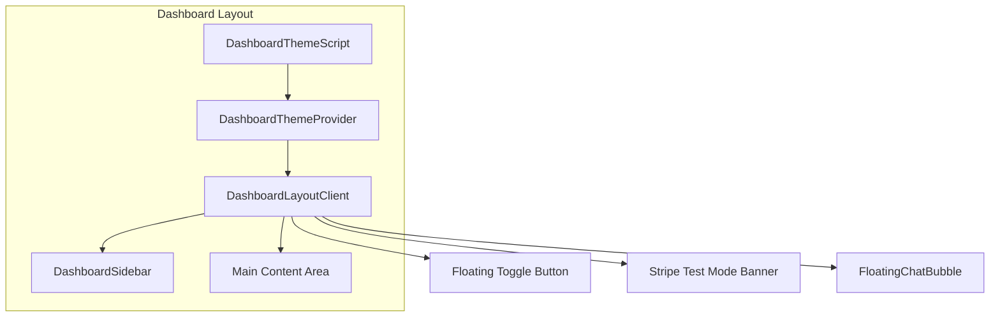

# Give Dashboard — Complete Attributes Reference

A comprehensive reference of all dashboard structure, pages, components, and attributes.

---

## Table of Contents

1. [Layout Architecture](#layout-architecture)
2. [Sidebar & Navigation](#sidebar--navigation)
3. [Authentication & Permissions](#authentication--permissions)
4. [Theme System](#theme-system)
5. [Dashboard Pages (Detailed)](#dashboard-pages-detailed)
6. [Shared UI Patterns](#shared-ui-patterns)
7. [Data Types](#data-types)
8. [API Dependencies](#api-dependencies)

---

## Layout Architecture

### File Structure

```
src/app/dashboard/
├── layout.tsx                    # Server layout (sidebar, theme, layout client)
├── page.tsx                      # Overview page
├── loading.tsx                   # Loading spinner
├── error.tsx                     # Error boundary
├── dashboard-layout-client.tsx   # Client: sidebar toggle, animations
├── dashboard-sidebar.tsx         # Sidebar nav + user block
├── dashboard-nav.tsx             # Client nav items (pathname-based active)
├── dashboard-overview.tsx        # Overview page content
├── dashboard-charts.tsx          # DonationTrendsChart, OrgDistributionChart
├── dashboard-summary.tsx         # Legacy summary (not used in Overview)
├── dashboard-welcome-banner.tsx  # Welcome banner with user name
├── dashboard-types.ts            # DonationRow, OrganizationRow, etc.
└── [page folders...]
```

### Layout Flow



### Layout Attributes

| Attribute | Value | Description |
|-----------|-------|-------------|
| Sidebar width (open) | `288px` | Fixed width when expanded |
| Sidebar animation | Framer Motion spring | `stiffness: 400, damping: 35` |
| Toggle button position | `left: 268px` (open) / `left: 4` (closed) | Fixed, vertically centered |
| Main padding | `pl-8` (sidebar open) / `pl-14` (closed) | Prevents content overlap |
| Sidebar persistence | `localStorage["dashboard-sidebar-open"]` | Survives page refresh |
| Min height | `min-h-screen` | Full viewport height |

---

## Sidebar & Navigation

### Brand Block (Static)

| Element | Attribute | Value |
|---------|-----------|-------|
| Logo | `G` in gradient pill | `from-emerald-500 via-emerald-600 to-teal-600` |
| Link | `href` | `/dashboard` |
| Homepage link | `href` | `/` |
| Icon | House SVG | `stroke="currentColor"` |

### Navigation Sections

Navigation is driven by `DashboardNav` with props:
- `isPlatformAdmin: boolean`
- `orgId: string | null`
- `onboardingCompleted?: boolean`

#### Section 1: Overview

| Route | Label | Icon | Condition |
|-------|-------|------|-----------|
| `/dashboard` | Overview | `LayoutDashboard` | Always (exact match) |
| `/dashboard/my-donations` | My donations | `Heart` | Always |
| `/dashboard/connections` | Connections | `UserPlus` | `orgId` present |
| `/dashboard/messages` | Messages | `MessageSquare` | `orgId` present |

#### Section 2: Organization

| Route | Label | Icon | Condition |
|-------|-------|------|-----------|
| `/dashboard/donations` | Donations | `Wallet` | `isPlatformAdmin` or `orgId` |
| `/dashboard/events` | Events | `Calendar` | `orgId` and not platform admin |
| `/dashboard/goals` | Goals | `Target` | `orgId` and not platform admin |
| `/dashboard/givers` | Givers | `Users` | `orgId` and not platform admin |
| `/dashboard/profile` | Public page | `FileText` | `orgId` and not platform admin |
| `/dashboard/customization` | Customization | `Palette` | `orgId` and not platform admin |
| `/dashboard/donation-links` | Donation links | `Link2` | `orgId` and not platform admin |

#### Section 3: Account

| Route | Label | Icon | Condition |
|-------|-------|------|-----------|
| `/dashboard/settings` | Settings | `Settings` | Always |
| `/dashboard/connect/verify` | Complete verification / Payout account | `CreditCard` | `orgId` and not platform admin |
| `/dashboard/connect/manage` | Manage billing | `Banknote` | `orgId` and `onboardingCompleted` |
| `/dashboard/admin` | Platform Admin | `ShieldCheck` | `isPlatformAdmin` only |

### Active State Styling

- **Active**: `bg-emerald-500/20 text-emerald-400 shadow-sm`
- **Inactive**: `text-dashboard-text-muted hover:bg-dashboard-card-hover/50 hover:text-dashboard-text`
- **Match logic**: Exact for Overview (`pathname === href`), prefix for others (`pathname.startsWith(href)`)

### User Block (Footer)

| Attribute | Source |
|-----------|--------|
| Avatar | First letter of `profile?.full_name ?? user.email ?? "U"` |
| Display name | `profile?.full_name ?? user.email` |
| Sign out | POST to `/api/auth/signout` |
| Theme toggle | `DashboardThemeToggle` (sun/moon) |

---

## Authentication & Permissions

### Auth Helpers (`src/lib/auth.ts`)

| Function | Returns | Redirects When |
|----------|---------|----------------|
| `getSession()` | `{ user, supabase }` | — |
| `requireAuth()` | `{ user, profile, supabase }` | No user → `/login` |
| `requirePlatformAdmin()` |同上 | Role not platform_admin → `/dashboard` |
| `requireOrgAdmin(organizationId?)` | `{ user, profile, supabase, organizationId }` | No org owner/admin → `/dashboard` |
| `getCachedDashboardAuth()` | `{ user, profile, supabase, orgId, isPlatformAdmin, onboardingCompleted }` | No user → `/login` |

### Profile Schema (`user_profiles`)

| Field | Type | Description |
|-------|------|-------------|
| `id` | `string` | Matches `auth.users.id` |
| `role` | `"donor" \| "organization_admin" \| "platform_admin"` | User role |
| `full_name` | `string | null` | Display name |
| `organization_id` | `string | null` | Primary org |
| `preferred_organization_id` | `string | null` | Selected org for multi-org users |

### Org Admin Check

- Owner: `organizations.owner_user_id === user.id`
- Admin: Row in `organization_admins` for `(organization_id, user_id)`

---

## Theme System

### Storage & State

| Key | Value | Default |
|-----|-------|---------|
| `localStorage["give-dashboard-theme"]` | `"dark"` or `"light"` | `"dark"` |
| `document.documentElement.classList` | `"dark"` when dark | — |

### CSS Variables (Dark Mode)

| Variable | HSL | Purpose |
|----------|-----|---------|
| `--dashboard-bg` | `222 47% 11%` | Main content area |
| `--dashboard-sidebar` | `217 33% 17%` | Sidebar background |
| `--dashboard-card` | `217 33% 17%` | Card surfaces |
| `--dashboard-card-hover` | `215 28% 22%` | Hover states |
| `--dashboard-border` | `217 33% 22%` | Borders |
| `--dashboard-text` | `210 40% 98%` | Primary text |
| `--dashboard-text-muted` | `215 20% 65%` | Secondary text |
| `--dashboard-input-bg` | `222 47% 11%` | Input background |
| `--dashboard-input-border` | `217 33% 25%` | Input border |

---

## Dashboard Pages (Detailed)

### 1. Overview — `/dashboard`

**File:** `page.tsx`  
**Auth:** `getCachedDashboardAuth()`  
**Data:** Donations (500 max), organizations (filtered by org or all for platform admin)

**Components:**
- `DashboardOverview` (props: donations, organizations, isPlatformAdmin, userName, needsVerification)
- `DashboardWelcomeBanner` (props: userName)

**Features:**

| Feature | Attributes |
|---------|------------|
| Needs verification banner | Shows when `!userOrg.onboarding_completed` and org user |
| Filters | Date range (start/end), organization, status (succeeded/pending/failed) |
| KPI cards | Active organizations, Total givers, Total donations |
| Donation trends chart | Line chart, `{ date, total }[]` |
| Org distribution chart | Pie chart, `{ org, total }[]` |
| Organizations table | ID, name, slug, type, status, total donations, created |
| Recent donations table | Date, endowment, campaign, status, currency, amount, email, giver, org, action |
| View donation modal | Full donation details |
| Add org modal | Platform admin only, links to Settings |
| Export | CSV of filtered donations |

---

### 2. My Donations — `/dashboard/my-donations`

**File:** `page.tsx`  
**Auth:** `supabase.auth.getUser()` (redirect if no user)  
**Data:** Donations by `user_id` + `donor_email`, subscriptions, saved orgs

**Attributes:**

| Section | Data Source | Attributes |
|---------|-------------|------------|
| Summary cards | `merged` donations | Total donated, YTD, Donation count |
| Year-end download | `YearEndDownload` | Tax summary PDF |
| Recurring subscriptions | `donor_subscriptions` | Amount, interval, org, Manage button |
| Quick give | `donor_saved_organizations` | Org list, "Give now" links |
| Donation history | Merged `user_id` + `donor_email` | Amount, org, campaign, date, Receipt, Give again |

**Donation merge logic:** Dedupe by `id`; prefer `user_id` matches over `donor_email`.

---

### 3. Connections — `/dashboard/connections`

**File:** `connections/page.tsx`  
**Auth:** `requireAuth()`, redirect if no `orgId`  
**Data:** `peer_requests` (pending to org), `peer_connections`, `chat_threads` per connection

**Components:** `ConnectionsClient`

**Props:**
- `pendingRequests`: Pending requests with `canAccept`
- `connections`: My org's connections
- `connectionThreads`: `{ connectionId: threadId }`
- `orgId`, `orgNames`

**Features:**
- Search orgs via `/api/peers/search?q=`
- Send request via `POST /api/peers/requests`
- Accept via `POST /api/peers/requests/[id]/accept`
- Decline via `POST /api/peers/requests/[id]/decline`
- Link to chat thread per connection

---

### 4. Messages — `/dashboard/messages`

**File:** `messages/page.tsx`  
**Auth:** `requireAuth()`, redirect if no `orgId`  
**Data:** `peer_connections` → `chat_threads` → other org name

**Attributes:**
- List of conversations (other org name, link to `?thread={id}`)
- `ChatThreadClient` when `?thread=` present (messages, send, etc.)

---

### 5. Donations — `/dashboard/donations`

**File:** `donations/page.tsx`  
**Auth:** `requireAuth()`  
**Data:** `donations` with `organizations`, `donation_campaigns` (500 max)

**Attributes:**
- Summary: Total received, Total givers, Successful count
- Table: Amount, Giver, Organization, Campaign, Status, Date

---

### 6. Donors — `/dashboard/donors`

**File:** `donors/page.tsx`  
**Auth:** `requireAuth()`, redirect if no org and not platform admin  
**Data:** Donations grouped by `donor_email` or `donor_name` or `id`

**Attributes:**
- Table: Donor, Email, Total given, Gifts, Last donation
- Key: `email` or `name:${name}` or `id:${id}`

---

### 7. Givers — `/dashboard/givers`

**File:** `givers/page.tsx`  
**Auth:** Same as Donors  
**Data:** Same aggregation as Donors

**Attributes:**
- Summary: Total givers, Total received, Total gifts
- Table: Giver, Email, Total given, Gifts, Last donation

---

### 8. Events — `/dashboard/events`

**File:** `events/page.tsx`  
**Auth:** `requireAuth()`, redirect if no org and not platform admin  
**Data:** `events` with `organizations`, org's `eventbrite_org_id`

**Attributes:**
- Eventbrite connect: `GET /api/eventbrite/connect?organizationId=&redirectTo=`
- Summary: Total, Upcoming, Past
- Create event: `/dashboard/events/new` (if Eventbrite connected)
- Table: Name, date/time, online flag, View (public), Edit

---

### 9. Goals — `/dashboard/goals`

**File:** `goals/page.tsx`  
**Auth:** `requireAuth()`, redirect if no `orgId`  
**Data:** `donation_campaigns` (all fields)

**Components:** `GoalsClient`

**Campaign fields:**
- `id`, `name`, `description`, `goal_amount_cents`, `current_amount_cents`, `goal_deadline`
- `is_active`, `suggested_amounts`, `minimum_amount_cents`, `allow_recurring`, `allow_anonymous`

**Features:**
- Create campaign: `POST /api/donation-campaigns`
- Update: `PATCH /api/donation-campaigns/[id]`
- Form: name, description, goal amount, deadline

---

### 10. Public Page — `/dashboard/profile`

**File:** `profile/page.tsx`  
**Auth:** `requireAuth()`, redirect if no org  
**Data:** Org (profile fields), `form_customizations`, `organization_team_members`, `org_embed_cards`

**Org profile fields:**
- `id`, `name`, `slug`, `logo_url`
- `page_hero_video_url`, `page_hero_image_url`
- `page_summary`, `page_mission`, `page_goals`, `page_story`
- `page_story_image_url`, `page_about_image_side`, `page_story_image_side`

**Components:** `InlinePageEditor`

---

### 11. Customization — `/dashboard/customization`

**File:** `customization/page.tsx`  
**Auth:** `requireAuth()`, redirect if no org and not platform admin  
**Data:** Org, `form_customizations`, `peer_connections`, `donation_campaigns`, `endowment_funds`

**Sections:**
1. **Embed cards** — `EmbedCardsPanel`
2. **Form settings** — `EmbedFormClient`
3. **Campaign goals** — `CampaignsEditor`
4. **Embed on Webflow & WordPress** — Static instructions

---

### 12. Donation Links — `/dashboard/donation-links`

**File:** `donation-links/page.tsx`  
**Auth:** `requireOrgAdmin()`  
**Data:** `donation_links`, connected peers with Connect accounts, org slug

**Components:** `DonationLinksClient`

**Link attributes:**
- `id`, `name`, `slug`, `splits` (percentage + accountId), `created_at`
- Splits: `{ percentage: number; accountId: string }[]` (must sum to 100)

**Features:**
- Create: `POST /api/donation-links`
- Delete: `DELETE /api/donation-links/[id]`
- Copy URL: `{baseUrl}/give/{orgSlug}?link={linkSlug}`

---

### 13. Settings — `/dashboard/settings`

**File:** `settings/page.tsx`  
**Auth:** `requireAuth()`  
**Data:** Org (Stripe Connect status)

**Stripe verification states:**
- `none` — No Connect account
- `actions_required` — Requirements due
- `pending` — Submitted, awaiting review
- `verified` — `charges_enabled` or `payouts_enabled`

**Sections:**
- Payout account (Connect status, links)
- Organization (name, link to Customization)
- Notifications (placeholder)
- Security & data (informational)

---

### 14. Connect Verify — `/dashboard/connect/verify`

**File:** `connect/verify/page.tsx`  
**Auth:** `requireAuth()`  
**Data:** Stripe account via `stripe.accounts.retrieve()`

**Components:**
- `ConnectOnboardingWrapper` (Stripe embedded component)
- `RefreshVerifyButton`
- `VerifyStatusFetcher`

**Attributes:**
- `needsVerification`: Has requirements and not verified
- `accountDisplayName`: Business name or email
- `accountError`: Invalid/placeholder account message

---

### 15. Connect Manage — `/dashboard/connect/manage`

**File:** `connect/manage/page.tsx`  
**Auth:** `requireAuth()`  
**Components:** `ConnectAccountManagementClient` (bank, billing)

---

### 16. Platform Admin — `/dashboard/admin`

**File:** `admin/page.tsx`  
**Auth:** `requirePlatformAdmin()`  
**Data:** `endowment_funds`, org count, donation stats

**Components:** `EndowmentFundsAdmin`

**Sections:**
- Platform analytics: orgs, total donations, endowment count
- Endowment funds: CRUD, Stripe Connect account link

---

### 17. Page Builder — `/dashboard/page-builder`

**File:** `page-builder/page.tsx`  
**Auth:** `requireAuth()`, redirect if no org  
**Data:** Org `id`, `name`, `slug`  
**Components:** `PageBuilderClient`

---

### 18. Embed — `/dashboard/embed`

**File:** `embed/page.tsx`  
**Action:** Redirect to `/dashboard/customization`

---

## Shared UI Patterns

### Fade-in Classes

| Class | Purpose |
|-------|---------|
| `dashboard-fade-in` | Base fade-in animation |
| `dashboard-fade-in-delay-1` through `-9` | Staggered delays |

### Chart Colors

```javascript
CHART_COLORS = ["#11B5AE", "#4046CA", "#F68512", "#DE3C82", "#7E84FA", "#72E06A"];
```

### Status Badges

| Status | Classes |
|--------|---------|
| succeeded / active | `bg-emerald-500/20 text-emerald-400` |
| pending | `bg-amber-500/20 text-amber-400` |
| failed / inactive | `bg-red-500/20 text-red-400` or `bg-slate-600/50 text-slate-400` |

---

## Data Types

### DonationRow (`dashboard-types.ts`)

```typescript
{
  id: string;
  amount_cents: number;
  status: string;
  created_at: string | null;
  organization_id: string | null;
  donor_email: string | null;
  donor_name: string | null;
  currency: string;
  campaign_id: string | null;
  endowment_fund_id: string | null;
  organizations: { name: string; slug: string } | null;
  donation_campaigns: { name: string } | null;
  endowment_funds: { name: string } | null;
}
```

### OrganizationRow

```typescript
{
  id: string;
  name: string;
  slug: string;
  org_type: string | null;
  created_at: string | null;
  onboarding_completed: boolean | null;
  totalDonations?: number;
}
```

### DonationFlat (client)

```typescript
{
  id: string;
  donationId: string;
  amount_cents: number;
  amount: number;
  status: string;
  createdAt: string | null;
  organization_id: string | null;
  orgName: string;
  donorEmail: string | null;
  donorName: string | null;
  currency: string;
  campaign: string | null;
  endowment: string | null;
}
```

---

## API Dependencies

| Route | Method | Used By |
|-------|--------|---------|
| `/api/auth/signout` | POST | Sidebar sign out |
| `/api/peers/search` | GET | Connections search |
| `/api/peers/requests` | POST | Connections send request |
| `/api/peers/requests/[id]/accept` | POST | Connections accept |
| `/api/peers/requests/[id]/decline` | POST | Connections decline |
| `/api/form-customization` | PATCH | Customization form save |
| `/api/embed-cards` | GET, POST | Embed cards CRUD |
| `/api/embed-cards/[id]` | PATCH, DELETE | Embed card update/delete |
| `/api/donation-links` | POST | Donation links create |
| `/api/donation-links/[id]` | DELETE | Donation links delete |
| `/api/donation-campaigns` | POST | Goals create |
| `/api/donation-campaigns/[id]` | PATCH | Goals update |
| `/api/chat/threads` | GET | Messages, FloatingChatBubble |
| `/api/me` | GET | Chat profile |

---

## Error & Loading States

| File | Purpose |
|------|---------|
| `error.tsx` | Error boundary: "Something went wrong", Try again, Dashboard link |
| `loading.tsx` | Centered teal spinner |

---

## Floating Chat Bubble

**File:** `components/floating-chat-bubble.tsx`  
**Position:** Fixed bottom-right, `z-9998`  
**Trigger:** `?thread=` in URL or click  
**Data:** `/api/chat/threads`, `/api/me`  
**Attributes:** Thread list, message thread, send, minimize
