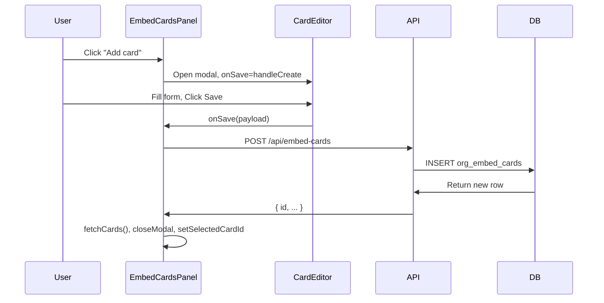

# How to Add a New Embedded Card

This guide explains how to add a new embed card in the Give platform—both from the **user's perspective** (dashboard UI) and from a **technical perspective** (API, data flow, components).

---

## Table of Contents

1. [User Guide: Adding a Card via Dashboard](#user-guide-adding-a-card-via-dashboard)
2. [Technical Overview](#technical-overview)
3. [Data Flow](#data-flow)
4. [API Reference](#api-reference)
5. [Card Styles & Requirements](#card-styles--requirements)
6. [Embedding the Card](#embedding-the-card)
7. [Troubleshooting](#troubleshooting)

---

## User Guide: Adding a Card via Dashboard

### Prerequisites

- You must be logged in as an **organization admin** or **owner**
- Your organization must exist (you have an org assigned to your profile)
- For **Goal** or **Goal compact** styles: create a campaign with a goal amount first in [Goals](/dashboard/goals)
- For **payment splits**: connect with peer organizations first in [Connections](/dashboard/connections)

### Step-by-Step Instructions

#### 1. Open the Customization Page

1. Go to **Dashboard** → **Customization** (or `/dashboard/customization`)
2. Locate the **Embed cards** section (first collapsible section, usually open by default)

#### 2. Click "Add card"

- Click the green **Add card** button in the top-right of the Embed cards section
- Or click the dashed **Add card** box in the grid
- A modal titled **Create new card** will open

#### 3. Fill Out the Card Form

**Required fields**

| Field | Description | Example |
|-------|-------------|---------|
| **Name** | Display name for the card (internal use) | "Building Fund", "General Donation" |

**Style** (required)

Choose one of five styles:

| Style | Description | When to Use |
|-------|-------------|-------------|
| **Full form** | Full donation form with media | Main donation experience |
| **Compressed** | Compact card with image/video and CTA | Sidebars, smaller embeds |
| **Goal card** | Progress bar + campaign goal | Fundraising campaigns |
| **Goal compact** | Minimal progress bar, no media | Compact campaign displays |
| **Minimal** | Minimal CTA button only | Clean, minimal layouts |

**If you chose Goal or Goal compact:**

- **Campaign** (required): Select a campaign from the dropdown. You can create one inline if none exist.
- **Goal description**: Text shown on the card (e.g., "Help us raise $50,000 for our new building")

**Media & Design**

| Field | Description |
|-------|-------------|
| **Media type** | Image or Video |
| **Title** | Headline on the card (e.g., "Make a Donation") |
| **Subtitle** | Subheadline (e.g., "Support our mission") |
| **Media URL** | Direct URL to image or video (e.g., Unsplash, Pexels) |

**Colors**

| Field | Format | Example |
|-------|--------|---------|
| **Button color** | Hex code | `#059669` |
| **Button text** | Hex code | `#ffffff` |
| **Primary (progress)** | Hex code (for goal styles) | `#059669` |

**Payment splits** (optional)

- Add splits to share donations with connected peer organizations
- Each split: select peer + percentage (e.g., 50% to Peer A, 50% to Peer B)
- Total must equal 100% if you add splits
- Go to [Connections](/dashboard/connections) first to connect with orgs

**Page section**

Where the card appears on your public org page:

| Value | Location |
|-------|----------|
| **Donation** | Main donation section |
| **Hero** | Below hero |
| **About** | Below about |
| **Team** | Below team |
| **Story** | Below story |

**Show on org page**

- Check **Show on org page** to display this card on your public page
- Uncheck to hide (e.g., for embed-only cards)

#### 4. Save

Click **Save** in the modal. The card will be created and appear in the grid.

#### 5. Copy the Embed Code

After creating the card:

1. Click the **Copy** button below the card thumbnail
2. The iframe code is copied to your clipboard, e.g.:
   ```html
   <iframe src="https://yoursite.com/give/your-slug/embed?card=CARD_ID" width="100%" height="600" frameborder="0" title="Donate to your-slug"></iframe>
   ```
3. Paste this into your website (Webflow Embed, WordPress Custom HTML, etc.)

#### 6. (Optional) Use on Page

If the card's page section is **Donation** and you want it as the main form on your org page:

- Click **Use on page** below the card
- This sets `org_page_embed_card_id` in form customizations

---

## Technical Overview

### Key Files

| File | Purpose |
|------|---------|
| `src/app/dashboard/embed/embed-cards-panel.tsx` | UI: card grid, Create/Edit modal, CardEditor |
| `src/app/api/embed-cards/route.ts` | GET (list), POST (create) |
| `src/app/api/embed-cards/[id]/route.ts` | PATCH (update, restore), DELETE (soft delete) |
| `src/app/dashboard/customization/page.tsx` | Page that renders EmbedCardsPanel |
| `src/app/give/[slug]/embed/page.tsx` | Public embed page (renders card by `?card=` param) |

### Database Table: `org_embed_cards`

| Column | Type | Required | Description |
|--------|------|----------|-------------|
| `id` | uuid | Auto | Primary key |
| `organization_id` | uuid | Yes | FK to organizations |
| `name` | text | Yes | Display name |
| `style` | text | Yes | full, compressed, goal, goal_compact, minimal |
| `campaign_id` | uuid | If goal style | FK to donation_campaigns |
| `design_set` | jsonb | No | `{ media_type, media_url, title, subtitle }` |
| `button_color` | text | No | Hex |
| `button_text_color` | text | No | Hex |
| `primary_color` | text | No | Hex (progress bar) |
| `goal_description` | text | No | For goal styles |
| `is_enabled` | boolean | No | Default true |
| `page_section` | text | No | donation, hero, about, team, story |
| `sort_order` | int | No | Display order |
| `splits` | jsonb | No | `[{ percentage, accountId }]` |
| `deleted_at` | timestamptz | No | Soft delete |

---

## Data Flow



### Create Payload (POST Body)

```json
{
  "organizationId": "uuid",
  "name": "Building Fund",
  "style": "goal",
  "campaign_id": "uuid",
  "design_set": {
    "media_type": "image",
    "media_url": "https://...",
    "title": "Make a Donation",
    "subtitle": "Support our mission"
  },
  "button_color": "#059669",
  "button_text_color": "#ffffff",
  "primary_color": "#059669",
  "goal_description": "Help us raise $50,000",
  "is_enabled": true,
  "page_section": "donation",
  "sort_order": 0,
  "splits": [
    { "percentage": 50, "accountId": "acct_xxx" },
    { "percentage": 50, "accountId": "acct_yyy" }
  ]
}
```

---

## API Reference

### Create Card: `POST /api/embed-cards`

**Headers:** `Content-Type: application/json`

**Body:**

| Field | Type | Required | Notes |
|-------|------|----------|-------|
| `organizationId` | string | Yes* | *From profile if not platform_admin |
| `name` | string | Yes | Trimmed, non-empty |
| `style` | string | Yes | full, compressed, goal, goal_compact, minimal |
| `campaign_id` | string | If goal/goal_compact | Must be valid campaign UUID |
| `design_set` | object | No | See design_set schema below |
| `button_color` | string | No | Hex |
| `button_text_color` | string | No | Hex |
| `primary_color` | string | No | Hex |
| `goal_description` | string | No | For goal styles |
| `is_enabled` | boolean | No | Default true |
| `page_section` | string | No | Default "donation" |
| `sort_order` | number | No | Default 0 |
| `splits` | array | No | `[{ percentage, accountId }]` |

**Design set schema:**

```json
{
  "media_type": "image" | "video",
  "media_url": "string | null",
  "title": "string | null",
  "subtitle": "string | null"
}
```

**Response:** `200` with created row, or `4xx`/`5xx` with `{ error: string }`

**Auth:** Requires `requireAuth()`. User must be org owner/admin or platform_admin.

---

## Card Styles & Requirements

| Style | Campaign required? | Media | Best for |
|-------|-------------------|-------|----------|
| **full** | No | Optional | Full donation form |
| **compressed** | No | Optional | Compact card |
| **goal** | Yes | Optional | Campaign with progress bar + media |
| **goal_compact** | Yes | No | Compact progress bar |
| **minimal** | No | Optional | Minimal CTA |

---

## Embedding the Card

### Embed URL Formats

| Use case | URL |
|----------|-----|
| Main form (default) | `{baseUrl}/give/{slug}/embed` |
| Specific card | `{baseUrl}/give/{slug}/embed?card={cardId}` |
| Fullscreen | `{baseUrl}/give/{slug}/embed?fullscreen=1` |
| Compact | `{baseUrl}/give/{slug}/embed?compact=1` |

### Iframe Code

```html
<iframe src="https://yoursite.com/give/your-org-slug/embed?card=CARD_ID" width="100%" height="600" frameborder="0" title="Donate to your-org-slug"></iframe>
```

### Webflow

1. Add an **Embed** element
2. Paste the iframe code into the Embed code field
3. Resize (e.g., 100% width, 600px height)

### WordPress

1. Add a **Custom HTML** block
2. Paste the iframe code
3. Or use a plugin like "Insert HTML Snippet" or "Embed Code"

---

## Troubleshooting

| Issue | Cause | Solution |
|-------|-------|----------|
| "campaign_id required for goal styles" | Goal/Goal compact chosen without campaign | Select or create a campaign in the form |
| "organizationId required" | Not logged in or no org | Log in, ensure you have an org |
| "Forbidden" | Not org admin | Ensure you're owner or in organization_admins |
| No connected peers for splits | No connections | Go to Connections, send/accept requests |
| Card not showing on embed | Wrong card ID or embed URL | Use Copy button to get correct embed URL with card ID |
| Deleted card still in list | Soft delete | Restore from "Recently deleted" section |

---

## Summary Checklist

- [ ] Log in as org admin
- [ ] Go to Dashboard → Customization
- [ ] Click Add card
- [ ] Enter name
- [ ] Choose style (create campaign if goal style)
- [ ] Add media (optional): title, subtitle, URL
- [ ] Set colors (optional)
- [ ] Add splits (optional)
- [ ] Choose page section
- [ ] Check "Show on org page" if desired
- [ ] Click Save
- [ ] Click Copy to get embed code
- [ ] Paste into your website
