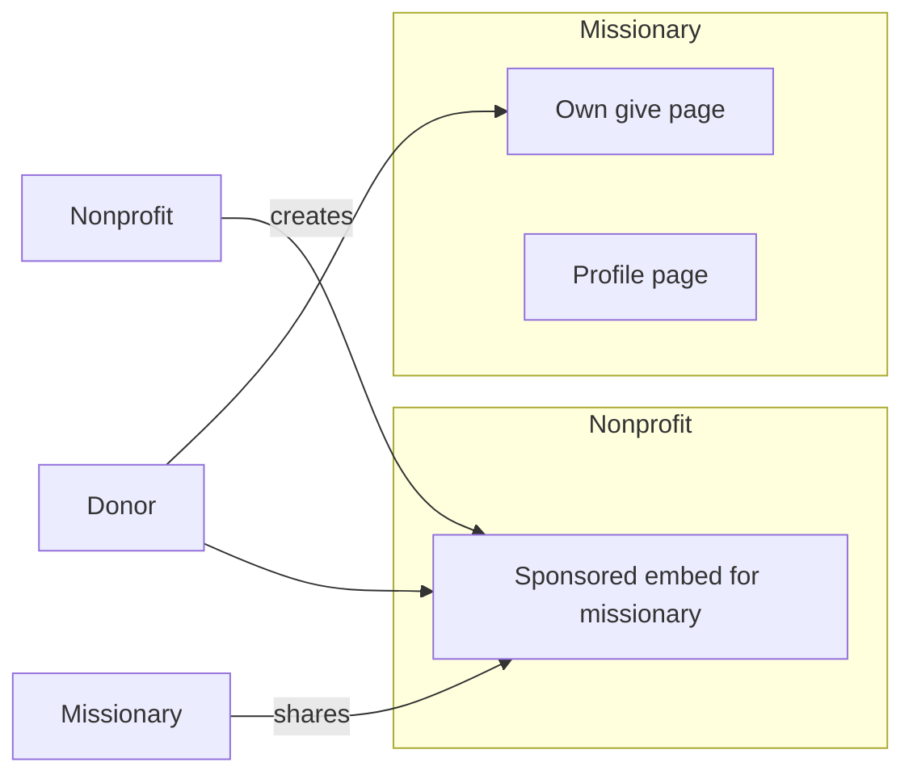
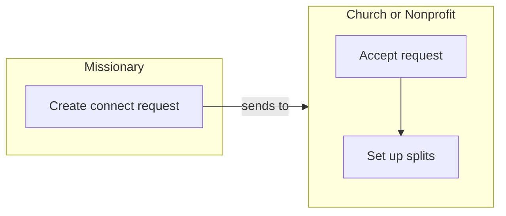

# Church, Missionary & Nonprofit Model

Churches, nonprofits, and missionaries all have their own give pages. Missionaries do **not** have their own embedded form—they share a **sponsored embed** from their sponsoring nonprofit when they want to embed on external sites.

---

## Entity Types

| Entity | Has own give page | Own embedded form | Can receive | Can give | Connect request |
|--------|-------------------|-------------------|-------------|----------|------------------|
| **Church** | Yes | Yes | Yes | Yes | Receives (from missionary) |
| **Nonprofit** | Yes | Yes | Yes | Yes | Receives (from missionary) |
| **Missionary** | Yes | **No** | Yes | No | **Initiates** (to church/nonprofit) |

All three can sign up.

---

## Missionaries: Give Page Yes, Embed No

**Missionaries CAN have their own give page** (e.g. `/give/missionary-slug`). Donors can give directly there.

**Missionaries do NOT have their own embedded form.** When they want to embed on their website, social, etc., they use a **sponsored embed** created by their nonprofit.



---

## Page Structure by Entity

| Entity | Public profile | Give page | Own embed | Sponsored embed to share |
|--------|----------------|-----------|-----------|--------------------------|
| Church | Yes | Yes | Yes | — |
| Nonprofit | Yes | Yes | Yes | Yes (for missionaries) |
| Missionary | Yes | Yes | **No** | Shares nonprofit's embed |

---

## Missionary-Specific Needs

| Feature | Church | Nonprofit | Missionary |
|---------|--------|-----------|------------|
| Public profile page | Yes | Yes | Yes |
| Own give page | Yes | Yes | Yes |
| Own embedded form | Yes | Yes | **No** |
| Sponsored embed to share | — | Yes (creates for missionaries, **builds in split**) | Shares nonprofit's embed |
| Stripe Connect (receive payouts) | Yes | Yes | Yes |
| Dashboard | Yes | Yes | Yes |
| Team members | Yes | Yes | No (individual) |
| Connect with church/nonprofit | Yes | Yes | **Initiates connect request** |
| Events | Yes | Yes | Optional |
| Campaigns / Goals | Yes | Yes | Yes |

---

## Sign-Up Flows

1. **Church** — Sign up as organization, select type: Church
2. **Nonprofit** — Sign up as organization, select type: Nonprofit
3. **Missionary** — Sign up as individual, create missionary profile, link to sponsoring nonprofit

Missionaries are linked to a nonprofit (sending org). The nonprofit creates sponsored pages/embeds for them.

---

## Connect Request (Missionary → Church / Nonprofit)

**Missionaries initiate a connect request** to a church or nonprofit. Once the church/nonprofit accepts, they are connected and can set up **splits**.



**Flow:**
1. Missionary searches for a church or nonprofit
2. Missionary sends a **connect request**
3. Church/nonprofit receives request, can accept or decline
4. Once connected: **nonprofit builds the split** into donation links, embeds, etc.

**Splits:** The **nonprofit configures the split**—e.g. when creating a sponsored embed or donation link for a missionary, the nonprofit sets the percentages (e.g. 80% to missionary, 20% to nonprofit). The split is built in by the nonprofit.

---

## One-Click Giving (Churches)

Churches can save and give to:
- Other churches
- Nonprofits
- Missionaries (donations go to the missionary's sponsoring nonprofit, designated for that missionary)

---

## Sponsored Embed Flow (When Missionary Wants to Embed)

1. Nonprofit adds missionary to their org (missionary profile linked to nonprofit)
2. Nonprofit creates a **sponsored embed** designated for that missionary, **building in the split** (e.g. 80% missionary, 20% nonprofit)
3. Missionary gets shareable embed code
4. Missionary embeds on their website, social, email, etc.
5. Donations go to the nonprofit, tagged/designated for the missionary
6. Nonprofit disburses to missionary (outside or inside app)

Missionary's **own give page** receives donations directly (missionary has Stripe Connect). The **sponsored embed** routes to the nonprofit.

---

## Data Model (Conceptual)

```
organizations
├── id, name, slug
├── entity_type: 'church' | 'nonprofit'
├── stripe_connect_account_id
└── ...

missionaries (or org with type missionary)
├── id, user_id, slug
├── sponsoring_organization_id (optional - for sponsored embed)
├── stripe_connect_account_id (for own give page)
└── ...

embed_cards (nonprofit-owned)
├── organization_id (nonprofit)
├── missionary_id (optional - sponsored embed for missionary)
└── ...

peer_requests (connect requests)
├── requester_id (missionary)
├── recipient_id (church or nonprofit)
├── status: pending | accepted | declined
└── ...

peer_connections (after accept)
├── side_a (missionary)
├── side_b (church or nonprofit)
└── ...

splits (built in by nonprofit)
├── donation_link or embed (nonprofit-owned)
├── percentage to missionary
├── percentage to nonprofit
└── ...
```

---

## Implementation Path

1. Add `org_type` to organizations (church, nonprofit, missionary).
2. Missionaries: own give page, Stripe Connect, profile, dashboard.
3. **Connect requests**: Missionary initiates request to church/nonprofit; church/nonprofit accepts → connection.
4. **Splits**: Nonprofit builds the split into donation links and embeds (configures % to missionary, % to nonprofit).
5. Nonprofit dashboard: "Add missionary" → create sponsored embed for missionary to share.
6. Missionary dashboard: manage profile, give page, **send connect requests**, copy sponsored embed when needed.
7. Embed cards: missionary cannot create own; can only share nonprofit's sponsored embed.

---

*Missionaries have their own give page and initiate connect requests to churches/nonprofits. Once connected, they can split donations. They do not have their own embedded form—they share the nonprofit's sponsored embed when embedding.*

---

## Pricing

**Who pays:** Only **churches** and **nonprofits** pay. **Missionaries are always free.**

| Entity | Pays | Notes |
|--------|------|-------|
| Church | Yes | Subscription and/or platform fee |
| Nonprofit | Yes | Subscription and/or platform fee |
| Missionary | **No** | Free—always |

**Connections are free** for all users. Missionaries, churches, and nonprofits can connect without paying.
