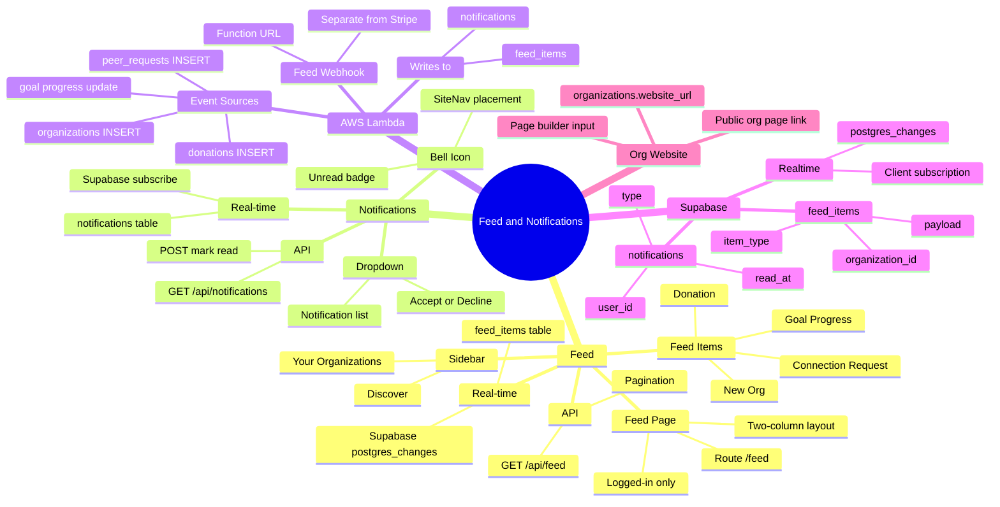
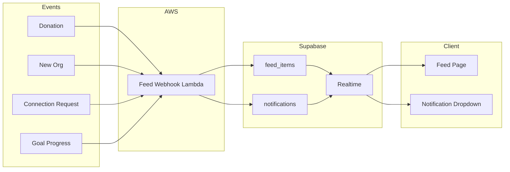
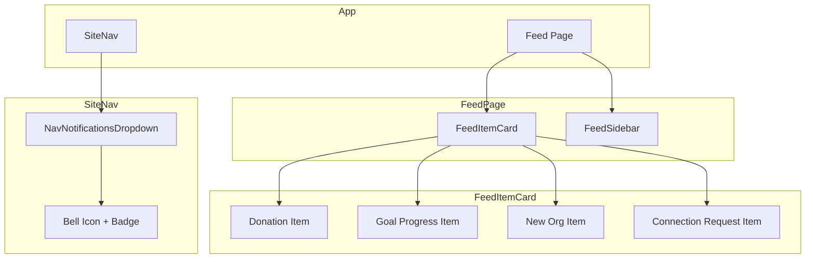

# Feed, Donations, and Org Website Plan

**Scope:** LinkedIn-style feed, org website link, notifications, geo-based discovery, real-time streaming via AWS + Supabase. **YouTube deferred.**

---

## Table of Contents

1. [Architecture Mind Map](#architecture-mind-map)
2. [Real-Time Architecture](#real-time-architecture-aws-webhook--supabase-streaming)
3. [LinkedIn-Style Feed (Detailed)](#linkedin-style-feed-detailed)
4. [Notification System (Detailed)](#notification-system-detailed)
5. [Organization Website Link](#organization-website-link)
6. [Database Schema](#database-schema)
7. [Implementation Steps (AI Instructions)](#implementation-steps-ai-instructions)

---

## Architecture Mind Map



### Data Flow Diagram



### Component Hierarchy



---

## Real-Time Architecture: AWS Webhook + Supabase Streaming

### Flow

```
Event (donation, new org, connection request, goal update)
    → Feed/Notification Webhook (AWS Lambda) — SEPARATE from Stripe webhook
    → Lambda writes to Supabase (feed_items, notifications)
    → Supabase Realtime (postgres_changes)
    → Client subscribes → UI updates instantly
```

### Components

| Component | Role |
|-----------|------|
| **Feed webhook** | AWS Lambda with Function URL. Receives events. **Separate from Stripe webhook**—different endpoint, different payload. |
| **AWS Lambda** | Processes events, enriches data, writes to Supabase `feed_items` and/or `notifications`. |
| **Supabase** | Source of truth. Lambda inserts rows. Supabase Realtime broadcasts `postgres_changes` to subscribed clients. |
| **Client** | Subscribes to `feed_items` and `notifications`; new rows stream in; UI updates without refresh. |

### Event sources

- **Donation:** Supabase Database Webhook on `donations` INSERT → POST to Lambda URL
- **New org:** Supabase Database Webhook on `organizations` INSERT → POST to Lambda URL
- **Connection request:** Supabase Database Webhook on `peer_requests` INSERT → POST to Lambda URL
- **Goal progress:** When `donation_campaigns.current_amount_cents` updates → trigger feed webhook

---

## LinkedIn-Style Feed (Detailed)

### Page layout

- **Route:** `/feed`
- **Access:** Logged-in only. Redirect to `/login` if not authenticated.
- **Layout:** Two-column on desktop; single column on mobile.
  - **Left column (main):** Feed stream. Max width ~600px, centered or left-aligned.
  - **Right column (sidebar):** "Your organizations" + "Discover" when user has few connections. Sticky. ~300px wide.
- **Background:** `min-h-screen bg-gradient-to-b from-slate-50 to-white` (match Explore).
- **Container:** `mx-auto max-w-7xl px-6 py-10` (match Explore).

### Feed item types and exact UI

#### 1. Donation item

- **Card:** `rounded-2xl border border-slate-200/80 bg-white shadow-sm p-4` (match OrgResultCard).
- **Content:**
  - Icon: DollarSign or Heart (lucide-react), small, emerald-500.
  - Text: "**$50** donated to **[Org Name]**"
  - Subtext: "2 hours ago" (relative time).
  - **Never show donor name or email.**
- **Click:** Links to `/org/[slug]`.
- **Payload:** `{ amount_cents, organization_id, organization_name, organization_slug, created_at }`

#### 2. Goal progress item

- **Card:** Same as donation. Progress bar at bottom.
- **Content:**
  - Icon: Target or TrendingUp (lucide-react).
  - Text: "**[Org Name]** is **20%** toward their **$10,000** goal"
  - Campaign name if available: "Building fund"
  - Progress bar: `h-2 rounded-full bg-slate-200`; fill `bg-emerald-500` (or `bg-emerald-600` when ≥80%).
  - Subtext: "Help them get there"
- **Click:** Links to `/org/[slug]`.
- **Payload:** `{ organization_id, organization_name, organization_slug, campaign_id, campaign_name, goal_amount_cents, current_amount_cents, goal_pct, created_at }`

#### 3. New organization item

- **Card:** Same style. Org avatar/logo.
- **Content:**
  - Org logo (or placeholder): `h-12 w-12 rounded-full`
  - Text: "**[Org Name]** just joined Give"
  - Subtext: "Church in Austin, TX" (city, state from org).
  - CTA: "Visit" or "Connect" button.
- **Click:** Links to `/org/[slug]`.
- **Payload:** `{ organization_id, organization_name, organization_slug, logo_url, city, state, created_at }`

#### 4. Connection request item (if shown in feed)

- **Card:** Same style.
- **Content:**
  - Text: "**[Org Name]** wants to connect with you"
  - Buttons: "Accept" | "Decline"
- **Payload:** `{ peer_request_id, organization_id, organization_name, organization_slug }`

### Feed ordering

- Sort by `created_at` DESC (newest first).
- Interleave all types. No separate tabs for now.

### Feed empty states

- **User has connections:** "No activity yet. Check back soon."
- **User has no connections:** "Connect with organizations to see their activity" + CTA to Explore.

### Feed loading

- Skeleton: Same card shape, `animate-pulse`, `rounded-2xl border border-slate-200 bg-white p-4`.
- Show 4–6 skeleton cards while loading.

### Feed real-time subscription (exact code pattern)

```ts
// In feed page client component
const supabase = createClient();

useEffect(() => {
  const channel = supabase
    .channel('feed-items')
    .on(
      'postgres_changes',
      { event: 'INSERT', schema: 'public', table: 'feed_items' },
      (payload) => {
        const newRow = payload.new as FeedItem;
        // Optionally filter by user's geo/connections
        setItems((prev) => [newRow, ...prev]);
      }
    )
    .subscribe();
  return () => { supabase.removeChannel(channel); };
}, []);
```

### Feed API (GET /api/feed)

**Query params:** `?limit=20&offset=0` (pagination).

**Response shape:**
```json
{
  "items": [
    {
      "id": "uuid",
      "item_type": "donation" | "goal_progress" | "new_org" | "connection_request",
      "organization_id": "uuid",
      "organization_name": "string",
      "organization_slug": "string",
      "payload": { /* type-specific */ },
      "created_at": "ISO8601"
    }
  ],
  "hasMore": true
}
```

**Logic:** Return items from `feed_items` (or compute from donations/campaigns/orgs) filtered by user's connections + geo. Order by `created_at` DESC.

### Feed sidebar (right column)

- **Section: "Your organizations"**
  - List of saved + connected orgs. Avatar, name, "Visit" link.
  - If empty: "Discover organizations" → link to `/explore`.
- **Section: "Discover"** (when user has few connections)
  - Up to 3–5 orgs in same geo area.
  - Card: Same as OrgResultCard but compact. "Connect" or "Visit" button.

### Design tokens (match existing)

- Card: `rounded-2xl border border-slate-200/80 bg-white shadow-sm hover:border-emerald-200 hover:shadow-lg transition-all`
- Heading: `font-semibold text-slate-900`
- CTA: `text-sm font-medium text-emerald-600 hover:text-emerald-700`
- Use `motion/react` for `initial={{ opacity: 0, y: 20 }}` and `animate` on mount; `delay: index * 0.05` for stagger.

---

## Notification System (Detailed)

### Placement

- **Location:** In `SiteNav`, next to Messages and Connections icons (when user has org) or next to user avatar.
- **Desktop:** Bell icon button, `h-10 w-10 rounded-full`, same style as Messages/Connections.
- **Mobile:** Bell icon in mobile nav bar.

### Bell icon and badge

- **Icon:** `Bell` from lucide-react, `h-5 w-5`.
- **Badge:** Red dot or count when unread > 0.
  - If count ≤ 9: show number.
  - If count > 9: show "9+".
  - Position: `absolute -top-0.5 -right-0.5 h-5 min-w-[20px] rounded-full bg-rose-500 text-white text-xs font-bold flex items-center justify-center`.

### Dropdown (on click)

- **Position:** `absolute right-0 top-full mt-2 w-96 max-h-[80vh] overflow-y-auto`
- **Style:** `rounded-xl border border-slate-200 bg-white shadow-xl`
- **Header:** "Notifications" + "Mark all as read" link (if unread > 0)
- **List:** Vertical list of notification items. Newest first.

### Notification item (in dropdown)

- **Layout:** Flex row. Icon left, content center, timestamp right.
- **Types:**
  - **connection_request:** "[Org Name] wants to connect" + "Accept" | "Decline" buttons.
  - **connection_accepted:** "[Org Name] accepted your connection request."
  - (Future: donation_receipt, etc.)
- **Unread:** Slightly different background (`bg-emerald-50/50` or bold text).
- **Click:** Mark as read; for connection_request, clicking Accept/Decline marks read and performs action.

### Mark as read

- **Single:** PATCH or POST to `/api/notifications/[id]/read`.
- **All:** POST to `/api/notifications/read-all`.
- Update `read_at` in `notifications` table.

### Real-time subscription (notifications)

```ts
// In NavNotificationsDropdown or similar
useEffect(() => {
  if (!userId) return;
  const channel = supabase
    .channel(`notifications:${userId}`)
    .on(
      'postgres_changes',
      { event: 'INSERT', schema: 'public', table: 'notifications', filter: `user_id=eq.${userId}` },
      (payload) => {
        setNotifications((prev) => [payload.new, ...prev]);
        setUnreadCount((c) => c + 1);
      }
    )
    .subscribe();
  return () => { supabase.removeChannel(channel); };
}, [userId]);
```

### API: GET /api/notifications

**Response:**
```json
{
  "notifications": [
    {
      "id": "uuid",
      "type": "connection_request",
      "payload": { "organization_id", "organization_name", "organization_slug", "peer_request_id" },
      "read_at": null,
      "created_at": "ISO8601"
    }
  ],
  "unreadCount": 2
}
```

### API: POST /api/notifications/[id]/read

- Set `read_at = now()` for that notification.
- Return 200.

### API: POST /api/notifications/read-all

- Set `read_at = now()` for all notifications where `user_id = current_user` and `read_at IS NULL`.
- Return 200.

### Notification creation

- When `peer_requests` INSERT: Lambda (or app) creates a row in `notifications` with `type: 'connection_request'`, `user_id` = recipient (org owner or user being requested).

---

## Organization Website Link

- **Database:** `organizations.website_url` exists.
- **Page builder:** Add input field "Organization website" (URL). Save via API to `organizations.website_url`.
- **Public org page:** When `website_url` is set, show link: "Visit our website" or "Website" with external link icon. Place in hero or about section.

---

## Database Schema

### feed_items

| Column | Type | Description |
|--------|------|-------------|
| id | uuid | PK, default gen_random_uuid() |
| item_type | text | 'donation', 'goal_progress', 'new_org', 'connection_request' |
| organization_id | uuid | FK organizations |
| payload | jsonb | Type-specific data |
| created_at | timestamptz | default now() |
| geo_region | text | Optional, e.g. "TX" or "Austin,TX" |

**RLS:** Select for authenticated users. Insert/update via service role (Lambda).

**Realtime:** Enable for `feed_items`.

### notifications

| Column | Type | Description |
|--------|------|-------------|
| id | uuid | PK |
| user_id | uuid | Recipient (auth.users) |
| type | text | 'connection_request', 'connection_accepted', etc. |
| payload | jsonb | Type-specific |
| read_at | timestamptz | Null = unread |
| created_at | timestamptz | default now() |

**RLS:** Users can only select/update their own rows.

**Realtime:** Enable for `notifications`.

---

## Implementation Steps (AI Instructions)

### Step 1: Database migrations

1. Create `feed_items` table with columns above.
2. Create `notifications` table with columns above.
3. Enable Supabase Realtime for both tables.
4. Add RLS policies.

### Step 2: Feed page

1. Create `src/app/feed/page.tsx` — server component, redirect if not logged in.
2. Create `src/app/feed/feed-client.tsx` — client component with:
   - Initial fetch from GET /api/feed
   - Supabase subscription for `feed_items` INSERT
   - Render `FeedItemCard` for each item type
   - Sidebar with "Your organizations" and "Discover"
3. Create `src/components/feed/feed-item-card.tsx` — switch on `item_type`, render donation | goal_progress | new_org | connection_request card.
4. Create `src/components/feed/feed-sidebar.tsx` — Your orgs + Discover.
5. Create `src/app/api/feed/route.ts` — GET handler, pagination, return items.

### Step 3: Notifications

1. Add `NavNotificationsDropdown` component (similar to NavMessagesDropdown).
2. Add bell icon + badge to `SiteNav` when user is logged in.
3. Create `src/app/api/notifications/route.ts` — GET list.
4. Create `src/app/api/notifications/[id]/read/route.ts` — POST mark read.
5. Create `src/app/api/notifications/read-all/route.ts` — POST mark all read.
6. Subscribe to `notifications` Realtime in the dropdown.

### Step 4: Feed webhook (Lambda)

1. Create `lambda/feed-webhook/` — new Lambda, separate from stripe-webhook.
2. Lambda receives POST with `{ type, payload }` (from Supabase Database Webhooks or app).
3. Lambda inserts into `feed_items` and/or `notifications` via Supabase client.
4. Configure Supabase Database Webhooks: `donations`, `peer_requests`, `organizations` INSERT → POST to Lambda URL.

### Step 5: Org website

1. Add website URL input to dashboard page builder or settings.
2. Add API to update `organizations.website_url`.
3. On org public page, render "Visit our website" link when `website_url` is set.

### Step 6: Root redirect

- When logged in and user visits `/`, redirect to `/feed`.

---

## What We're NOT Building (For Now)

- Follow (use Connect/connections only)
- YouTube integration (deferred)
