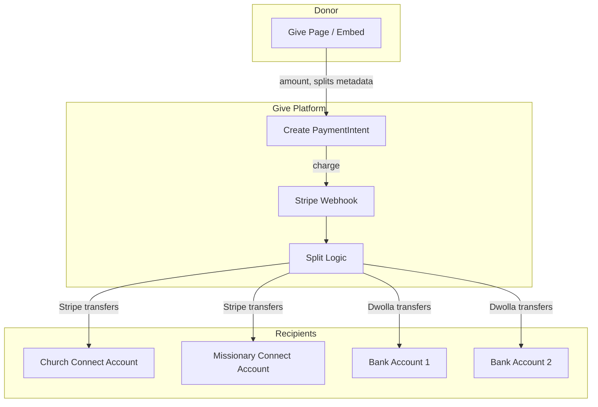

# Give App for Claude

**Purpose:** This document provides a full technical and product analysis of the Give donation platform so Claude AI can generate a business plan, investor proposal, or valuation analysis. Focus areas: **revenue splitting**, **connectability** (social/network layer), **missionary funding**, and **website builder**.

---

## 1. Executive Summary

**Give** is a donation and fundraising SaaS for churches and nonprofits built on Next.js 16, Supabase, and Stripe Connect Express. It differentiates from competitors through:

1. **Revenue splitting** — Automatic distribution of donations to multiple recipients (missionaries, partner orgs)
2. **Connectability** — A social layer where organizations connect, message, and collaborate; missionaries connect to churches/nonprofits
3. **Missionary support** — Churches can automatically fund missionaries via splits; missionaries have give pages and sponsored embeds
4. **Website builder** — 11 church templates, CMS, custom domains, embeddable donation forms

**Current state:** Production-ready app with 1% platform fee, Stripe Connect, Dwolla (optional bank splits), Plaid, real-time chat, feed, and discovery.

---

## 2. Core Differentiators (Competitive Edge)

### 2.1 Revenue Splitting (Primary Differentiator)

**What it does:**

- **Stripe Connect splits:** When a donation comes in, the platform can automatically split the charge to multiple connected Stripe accounts (e.g., 70% to church, 30% to missionary)
- **Dwolla bank splits:** Optional — split to external bank accounts via Plaid-linked accounts (requires Dwolla setup)

**Where splits are configured:**

- **Form customization** — Default splits for the org's donation form
- **Embed cards** — Per-card splits (full, compressed, goal, goal_compact, minimal)
- **Donation links** — Shareable URLs with specific split configurations

**Technical flow:**

- `create-payment-intent.ts` resolves splits from: donation link > embed card > form customization
- PaymentIntent metadata includes `splits: [{ percentage, accountId }]`
- Stripe webhook on `payment_intent.succeeded` creates multiple `stripe.transfers.create()` to connected accounts
- Idempotency via `split_transfers` table

**Competitive gap:** Most donation platforms (GiveLively, Donorbox, Tithe.ly) do not offer automatic multi-recipient splits. Churches typically manually transfer funds to missionaries. Give automates this.

---

### 2.2 Connectability (Social / Network Layer)

**What it does:**

- **Org-to-org connections:** Search organizations, send connection requests, accept/decline
- **Peer graph:** `peer_connections`, `peer_requests` tables
- **Chat threads:** Real-time messaging via Supabase `postgres_changes` on `chat_messages`
- **Fund requests:** Org requests funds in chat; donors fulfill via Stripe PaymentElement
- **Split proposals:** Org-to-org transfer splits (e.g., 50/50); both must accept before execution

**Missionary-specific flow:**

- Missionaries **initiate** connect requests to churches/nonprofits
- Church/nonprofit accepts → connection established
- Nonprofit configures splits (e.g., 80% missionary, 20% nonprofit) in donation links/embeds
- Missionary shares sponsored embed on their site; donations auto-split

**Data model:**

- `peer_requests` — requester_id, recipient_id, status (pending/accepted/declined)
- `peer_connections` — side_a_id, side_b_id (org or user)
- `chat_threads` — one per connection
- `chat_messages` — real-time via Supabase Realtime

**Competitive gap:** Donation platforms are typically single-org. Give adds a network effect: churches connect to missionaries, nonprofits to churches, enabling collaborative fundraising.

---

### 2.3 Missionary Support

**Entity types:**

| Entity     | Own give page | Own embed | Can receive | Connect request |
| ---------- | ------------- | --------- | ----------- | --------------- |
| Church     | Yes           | Yes       | Yes         | Receives        |
| Nonprofit  | Yes           | Yes       | Yes         | Receives        |
| Missionary | Yes           | **No**    | Yes         | **Initiates**   |

**Missionary flow:**

1. Missionary signs up, creates profile, links to sponsoring nonprofit
2. Missionary sends connect request to church/nonprofit
3. Church accepts → can configure splits for that missionary
4. Nonprofit creates **sponsored embed** for missionary (with split built in)
5. Missionary shares embed on website/social; donations route to nonprofit, split to missionary

**Missionaries are always free** — only churches and nonprofits pay.

---

### 2.4 Website Builder

**Templates:** 11 church styles (Grace Community, Modern Minimal, Warm Heritage, Bold Contemporary, Serene Light, Dark Elegant, Vibrant Community, Classic Reformed, Organic Natural, Urban Modern, Blank)

**Pages per template:** Home, About, Events, Give, Ministries, Media, Visit Us

**Tech:** GrapeJS Studio SDK, `website_builder_projects` table, `public_page_blocks`, CMS blocks (sermon archive, featured sermon, worship recordings, podcast)

**Custom domains:** `organization_domains` table, DNS verification, Route53/GoDaddy integration

---

## 3. Platform Stats (Live Metrics)

The platform tracks and displays these metrics (from `src/lib/platform-stats.ts`):

| Metric               | Source                                               |
| -------------------- | ---------------------------------------------------- |
| `totalOrganizations` | Count of `organizations`                             |
| `totalDonations`     | Count of `donations` where status = succeeded        |
| `totalDonatedCents`  | Sum of `amount_cents`                                |
| `uniqueDonors`       | Distinct `donor_email`                               |
| `totalEvents`        | Count of `events`                                    |
| `totalCampaigns`     | Count of `donation_campaigns` where is_active = true |

**Caching:** 60-second revalidation via Next.js `unstable_cache`

**Usage:** Homepage hero, pricing page, `live-stats-pulse` component

**Note:** Actual numbers depend on production data. For business plan, use these as the schema — Claude can note "platform tracks X, Y, Z; insert actual numbers when available."

---

## 4. Pricing Model

**Current (from `pricing-breakdown.tsx` and `constants.ts`):**

- **Platform fee:** 1% per payment
- **Stripe processing:** 2.9% + $0.30
- **Endowment:** 30% of platform fee to endowment fund
- **Plans:** Free ($0), Website ($35/mo), Pro ($49/mo)
- **Free tier:** 14-day trials for website builder and split transactions

**Fee coverage:** Org pays OR donor covers (donor can cover so org receives 100% of donation)

---

## 5. Technical Stack

| Layer       | Technology                                            |
| ----------- | ----------------------------------------------------- |
| Framework   | Next.js 16 (App Router, Turbopack)                    |
| Auth + DB   | Supabase (Postgres, Auth, Storage, Realtime)          |
| Payments    | Stripe Connect Express, PaymentIntents, Subscriptions |
| Bank splits | Dwolla (optional), Plaid                              |
| UI          | Radix, Tailwind, Motion, Recharts                     |
| State       | Zustand (minimal)                                     |

**Key tables (relevant to splits/connections):**

- `organizations`, `donations`, `donation_campaigns`
- `form_customizations` (splits, split_mode)
- `org_embed_cards` (splits per card)
- `donation_links` (splits per link)
- `peer_connections`, `peer_requests`
- `chat_threads`, `chat_messages`
- `split_transfers`, `split_bank_accounts`, `dwolla_transfers`
- `user_profiles` (is_missionary, missionary_sponsor_org_id)

---

## 6. Key Files Reference

| Area            | Files                                                                                                                                     |
| --------------- | ----------------------------------------------------------------------------------------------------------------------------------------- |
| Splits          | `create-payment-intent.ts`, `webhooks/stripe/route.ts`, `split-disbursement.ts`, `split-settings-panel.tsx`, `split-percentage-chart.tsx` |
| Connections     | `connections-client.tsx`, `api/peers/*`, `api/chat/*`                                                                                     |
| Missionary      | `missionary/page.tsx`, `add-missionary-button.tsx`, `convert-to-missionary-button.tsx`, `api/missionaries/*`                              |
| Website builder | `website-builder-templates.ts`, `page-builder-client.tsx`, `inline-page-editor.tsx`                                                       |
| Platform stats  | `platform-stats.ts`, `api/platform-stats/route.ts`                                                                                        |
| Docs            | `CHURCH_MISSIONARY_NONPROFIT_MODEL.md`, `ENABLE_SPLITS_AND_FUND_REQUESTS.md`                                                             |

---

## 7. Competitive Landscape (For Claude to Expand)

**Direct competitors:** GiveLively, Donorbox, Tithe.ly, Pushpay, Planning Center Giving

**Give's unique combination:**

- Splits (automatic multi-recipient) — rare in donation SaaS
- Connectability (org-to-org, missionary-to-church) — social layer not typical
- Website builder + donation forms + discovery — all-in-one
- Missionary-focused model — churches fund missionaries with one-click splits

**Suggested research for Claude:** Look up competitor pricing, feature matrices, and funding rounds to position Give.

---

## 8. Monetization & Valuation Considerations

**Revenue streams (current/possible):**

- Platform fee (1% of GMV)
- Subscription tiers ($35–$49/mo)
- Implementation/consulting services
- White-label / enterprise (denominations, networks)

**Valuation drivers:**

- GMV (total donations processed)
- Number of organizations, missionaries, connections
- Split transaction volume (differentiator)
- Website builder adoption

**Existing analysis:** `.cursor/plans/give_app_investor_analysis_8476df57.plan.md` contains a prior investor-style analysis (free platform lens, services revenue paths).

---

## 9. Prompt for Claude AI

**Suggested prompt to paste with this document:**

> I'm sharing a comprehensive technical and product analysis of my donation platform, **Give**. Please use this document to:
>
> 1. Write a professional business plan (executive summary, market analysis, product description, revenue model, competitive differentiation, go-to-market, financial projections)
> 2. Emphasize our differentiators: **revenue splitting** (automatic distribution to missionaries, partner orgs) and **connectability** (social layer where churches connect to missionaries, orgs message and collaborate)
> 3. Research and compare us to competitors (GiveLively, Donorbox, Tithe.ly, etc.) — what do they lack that we offer?
> 4. Provide a realistic valuation range and/or acquisition potential based on platform metrics (organizations, donations, GMV, split transactions)
> 5. Include a section on missionary support — churches can automatically fund missionaries via splits; missionaries connect to churches and receive sponsored embeds
>
> The platform has: Stripe Connect, Supabase, Next.js, 11 website templates, embed cards, donation links, real-time chat, discovery/explore, and both Stripe Connect splits and Dwolla bank splits (optional).

---

## 10. Data Flow Diagram (Mermaid)

---

## Appendix: Feature Flags

- `SPLITS_ENABLED = true` — Payment splits (Stripe Connect) are live
- `FUND_REQUESTS_ENABLED = false` — Fund requests in chat are off
- `BANK_ACCOUNT_SPLITS_ENABLED` — Dwolla bank splits (requires Plaid/Dwolla)
