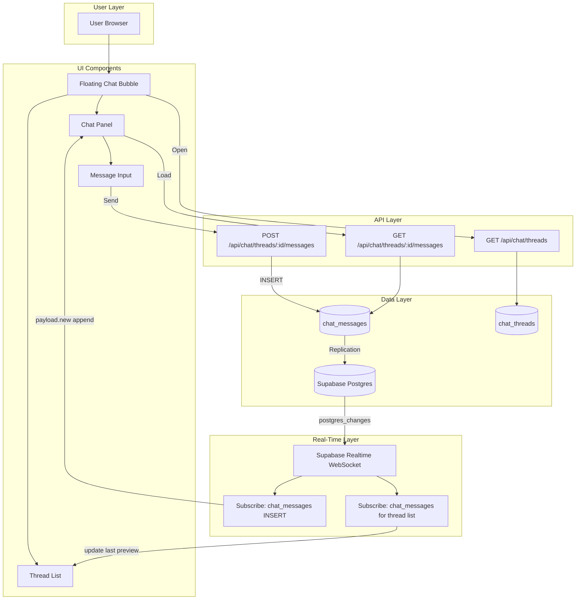

# LinkedIn-Style Messaging Redesign + Real-Time Streaming

## Overview

Redesign the floating chat bubble to look like LinkedIn messaging (not a green AI chatbot) and ensure messages stream in real time via Supabase Realtime—no AWS required for typical chat throughput.

**Implemented:**
- Messaging bubble only visible to **logged-in users with an organization** (matches nav Messages icon visibility)
- LinkedIn-style visual design: compact icon-only trigger (no "Messaging" label), cleaner message bubbles (`rounded-lg`), professional headers, "Write a message..." placeholder

---

## Part 1: Real-Time Streaming Architecture

### Current State

- Chat already uses **Supabase Realtime** (`postgres_changes` on `chat_messages`)
- On INSERT, client calls `loadMessages()` to refetch the entire thread
- **Gap:** `chat_messages` may not be in `supabase_realtime` publication (only `donations` is explicitly added)
- **Gap:** Full refetch on every new message instead of using the Realtime payload
- **Gap:** No optimistic UI when sending

### Target: Very Quick, Streaming Experience

| Improvement | Description |
|-------------|-------------|
| **1. Add chat_messages to Realtime** | Migration: `alter publication supabase_realtime add table chat_messages;` |
| **2. Use payload.new** | On `postgres_changes` INSERT, use `payload.new` to append the message directly—no refetch |
| **3. Optimistic UI** | When user sends, add message to UI immediately with "sending" state; confirm when API returns |
| **4. Thread list realtime** | Subscribe to `chat_messages` for all user threads; update last message preview in thread list when new message arrives |

### AWS

Supabase Realtime (WebSocket) is sufficient for chat. AWS would only be needed for:
- Very high throughput (thousands of messages/sec)
- Custom server-side processing before broadcast
- Cross-region replication

For typical org-to-org and user messaging, Supabase Realtime is fast enough.

---

## Part 2: Mind Map / Architecture Diagram

**Visual diagram:** See `messaging-architecture-mindmap.png` in the project assets.



### Simplified Flow (Boxes)

```
┌─────────────────────────────────────────────────────────────────────────────┐
│                         MESSAGING SYSTEM                                    │
├─────────────────────────────────────────────────────────────────────────────┤
│                                                                             │
│  ┌──────────────┐     ┌──────────────────┐     ┌──────────────────────┐   │
│  │   FLOATING   │     │   THREAD LIST     │     │    CHAT PANEL         │   │
│  │   BUBBLE     │────▶│   - Avatars       │────▶│    - Messages         │   │
│  │   (blue)     │     │   - Last preview  │     │    - Input + Send     │   │
│  └──────────────┘     │   - Date          │     └──────────┬───────────┘   │
│         │             └──────────────────┘                  │              │
│         │                         ▲                          │              │
│         │                         │ Realtime                 │              │
│         ▼                         │ (payload.new)             ▼              │
│  ┌──────────────────────────────────────────────────────────────────────┐  │
│  │                    SUPABASE REALTIME (WebSocket)                      │  │
│  │  • postgres_changes on chat_messages                                  │  │
│  │  • Append new message from payload.new (no refetch)                   │  │
│  │  • Update thread list last preview                                   │  │
│  └──────────────────────────────────────────────────────────────────────┘  │
│         ▲                                                                   │
│         │ INSERT                                                            │
│  ┌──────┴──────┐                                                            │
│  │  API POST   │  Optimistic: show message immediately, then confirm       │
│  │  /messages  │                                                            │
│  └─────────────┘                                                            │
│                                                                             │
└─────────────────────────────────────────────────────────────────────────────┘
```

---

## Part 3: Visual Redesign (LinkedIn Style)

### Color Changes

| Element | Current | New |
|---------|---------|-----|
| Floating button | emerald-500 | slate-700 or blue-600 |
| Send button | emerald-500 | blue-600 |
| My message bubble | emerald-500 | blue-600 |
| Links / accents | emerald-500/600 | blue-600/700 |
| Thread avatar fallback | emerald-500/20 | slate-200 / slate-600 |

### Thread List

- Profile avatars (from `otherProfileImageUrl ?? otherLogoUrl`)
- Last message preview (truncated)
- Date (e.g. "Feb 13")
- Header: "Messaging" + ellipsis + compose icon

### Chat Panel

- My messages: blue bubbles
- Their messages: white/gray with border
- Optional: sender avatar + name for their messages

---

## Applying the Realtime Migration

The migration adds `chat_messages` to Supabase Realtime so new messages stream instantly.

**Option A – Supabase CLI:**
```bash
supabase login
supabase link --project-ref YOUR_PROJECT_REF   # from Dashboard URL
pnpm run db:push
```

**Option B – Direct database URL:**
1. Supabase Dashboard → Project Settings → Database → Connection string (URI)
2. Add to `.env.local`: `DATABASE_URL="postgresql://..."`
3. Run: `pnpm run db:migrate:chat-realtime`

**Option C – SQL Editor:**
1. Supabase Dashboard → SQL Editor
2. Run: `alter publication supabase_realtime add table chat_messages;`

---

## Part 4: Files to Modify

1. **Migration:** `supabase/migrations/20260215000000_add_chat_messages_to_realtime.sql`
   - `alter publication supabase_realtime add table chat_messages;`

2. **API:** `src/app/api/chat/threads/route.ts`
   - Add `otherLogoUrl`, `otherProfileImageUrl`, `lastMessagePreview`, `lastMessageAt`

3. **Component:** `src/components/floating-chat-bubble.tsx`
   - Use `payload.new` in Realtime callback (append, don't refetch)
   - Optimistic UI on send
   - Thread list subscription for last message updates
   - LinkedIn-style colors and layout

4. **Nav:** `src/components/nav-messages-dropdown.tsx` — blue accents

5. **Dashboard:** `src/app/dashboard/messages/page.tsx` — blue accents (optional)
