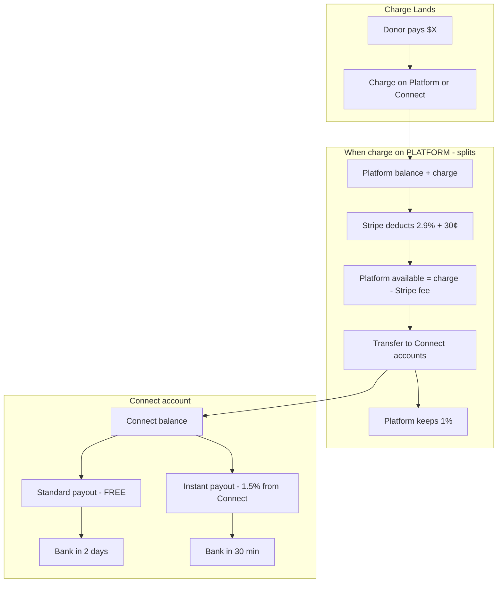

# Platform Balance & Fast Transfers — When Can Your Business Account Go Negative?

**Update (Feb 2025):** The split transfer amount now correctly subtracts Stripe fee: `netAmount = charge - Stripe fee - platform fee`. This prevents platform overdraw. Run `pnpm run test:split-math` to verify the math.

This document maps how money flows through your Stripe accounts and when your **platform balance** could go negative, especially with fast/instant transfers.

---

## 1. Two Different "Fast" Concepts

| Concept | What It Is | Who It Affects | Fee |
|--------|------------|----------------|-----|
| **Transfer** (platform → Connect) | Your webhook calls `stripe.transfers.create` immediately when `payment_intent.succeeded` fires | Platform balance → Connect account balance | $0 |
| **Instant Payout** (Connect → bank) | Connect account pays out to their bank in ~30 min instead of 2 days | Connect account balance → their bank | 1.5% (deducted from Connect's payout) |

**Your code does NOT use instant payouts.** So the only "fast" part is the transfer in the webhook.

---

## 2. Money Flow Map



---

## 3. When Can Your Platform Balance Go Negative?

### Scenario A: Transfer Amount vs Available Funds

For **splits** (charge on platform), the flow is:

1. Charge lands on platform (e.g. $100)
2. Stripe deducts processing fee (2.9% + 30¢ ≈ $3.20)
3. **Platform available** = $100 − $3.20 = **$96.80**
4. Your webhook transfers: `netAmount = charge − 1% = $99`

**Problem:** You try to transfer $99 when only $96.80 is available.

With `source_transaction`, Stripe links the transfer to the charge. Per Stripe docs:
- The transfer request **succeeds** (doesn't fail immediately)
- The transfer **executes only when funds are available**
- If the transfer amount exceeds available funds, the transfer **fails when it tries to execute** (insufficient funds)

So in practice: either the transfer fails, or Stripe allows it and your platform goes negative. Stripe's behavior depends on how they handle this edge case.

**Safe rule:** Transfer amount should not exceed `charge − Stripe fee − platform fee`:

```
Correct transfer = charge − (2.9% × charge + 30¢) − (1% × charge)
                 = charge − Stripe fee − platform fee
```

Your current code uses `charge − platform fee`, which can exceed available funds when Stripe fee > platform fee (which is almost always for `org_pays`).

---

### Scenario B: Instant Payouts (You Don't Use These)

If a **Connect account** does an instant payout:

- The 1.5% fee is **deducted from the Connect account's payout**, not from your platform
- Your platform balance is **not** charged
- So instant payouts do **not** cause your platform to go negative

---

### Scenario C: Automatic Payouts Draining Platform Before Transfers

Stripe can automatically pay out your platform balance to your bank on a schedule. If that happens **before** transfers execute:

- Funds leave your platform
- When the transfer tries to execute, there may be insufficient funds
- Transfer fails with "Insufficient funds"

**Mitigation:** Use `source_transaction` (you already do for splits) so transfers are tied to the charge and execute when those funds are available. Consider **manual payouts** for your platform if you need more control.

---

## 4. Summary: Your Risk of Negative Balance

| Situation | Platform Goes Negative? |
|-----------|--------------------------|
| Splits + `org_pays` + transfer amount > available | **Possible** — transfer may overdraw |
| Splits + `donor_both` (donor covers fees) | **Lower risk** — more funds available |
| Connect account does instant payout | **No** — fee comes from Connect, not platform |
| Your internal splits (`payouts.create`) | **No** — standard payouts, no extra fee to platform |

---

## 5. Recommendations to Avoid Negative Balance

1. **Fix transfer amount for splits (org_pays):**  
   Use `charge − Stripe fee − platform fee` instead of `charge − platform fee` so you never transfer more than is available.

2. **Keep `source_transaction`** on all transfers so they are linked to the charge and execute when funds are available.

3. **Add `source_transaction` to endowment transfer** (currently missing in [route.ts](src/app/api/webhooks/stripe/route.ts) lines 537–544) so it behaves like split transfers.

4. **Do not enable instant payouts** for Connect accounts unless you explicitly want them; your current code does not use them.

5. **Optional:** Use manual payouts for your platform so automatic payouts don't drain balance before transfers run.

---

## 6. Quick Reference: Fee Deduction Order

Per Stripe docs for separate charges and transfers:

1. Charge lands on platform
2. **Stripe fee** is deducted from platform balance
3. **Transfers** use what remains
4. Platform keeps the remainder (your 1% fee)

So: `Platform keeps = charge − Stripe fee − sum(transfers)`  
If `sum(transfers) > charge − Stripe fee`, you risk negative balance or failed transfers.
